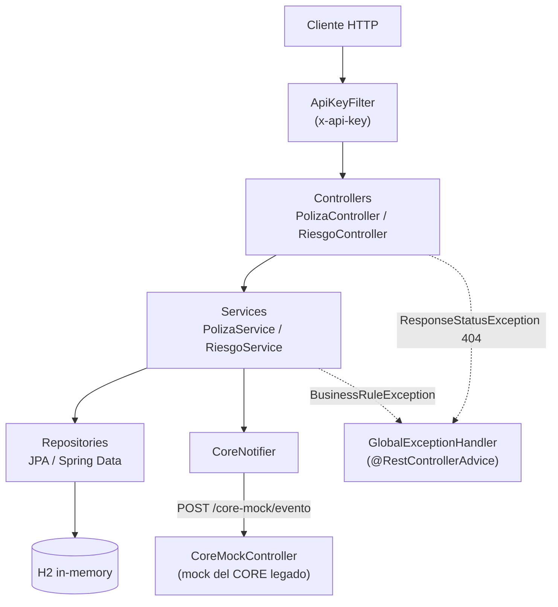
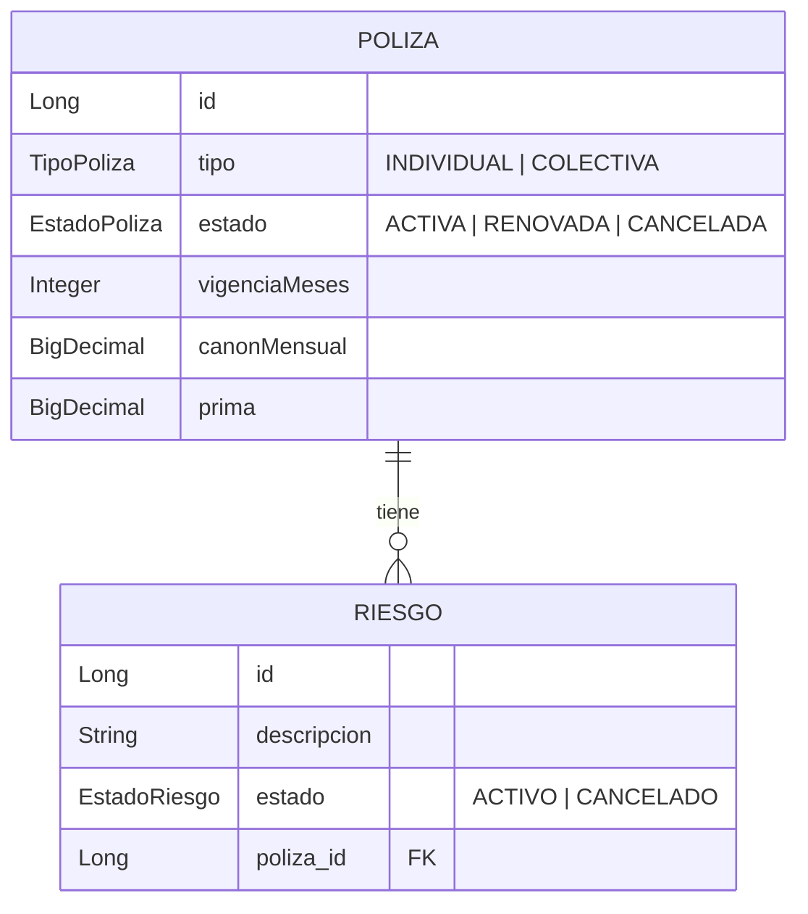
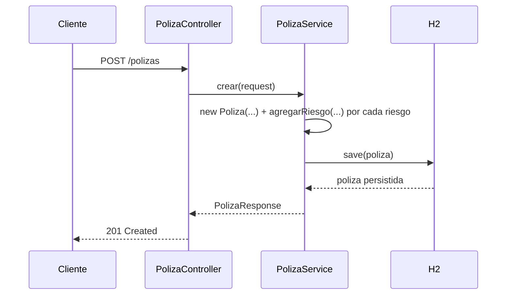
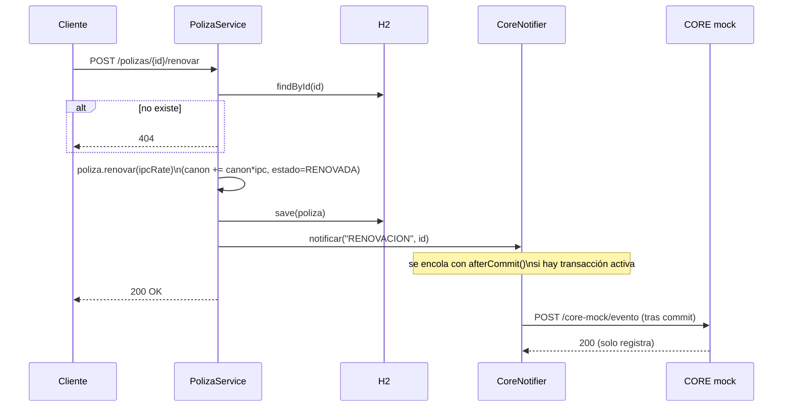
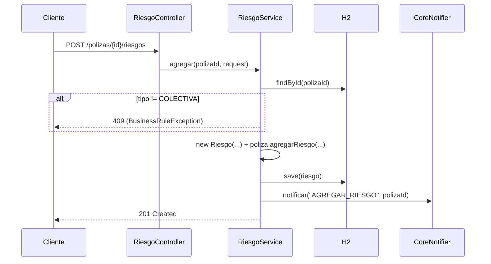

# Arquitectura — polizas-api

Documenta la arquitectura tal como está implementada hoy en `polizas-api/`. No describe diseño objetivo ni patrones aspiracionales, solo lo que existe en el código.

## Capas

Monolito en capas, un proceso, una base H2 en memoria.

- **`ApiKeyFilter`** — protege `/polizas` y `/riesgos` (detalle en [Seguridad](#seguridad)).
- **Controllers** — delegan a los services, sin lógica de negocio.
- **Services** — reglas de negocio y transacciones (`@Transactional`).
- **Entities** (`Poliza`, `Riesgo`) — validan sus propias invariantes; `agregarRiesgo`, `renovar`, `cancelar` lanzan `BusinessRuleException`.
- **`GlobalExceptionHandler`** — único punto que traduce excepciones a respuestas HTTP (409 reglas de negocio, 400 validación de DTO).

## Modelo de datos

Reglas embebidas en el modelo:

- Póliza `INDIVIDUAL` admite máximo 1 riesgo; `COLECTIVA` admite varios.
- `prima = canonMensual * vigenciaMeses`, recalculada en cada renovación.
- Cancelar una póliza cancela en cascada todos sus riesgos activos.

## Flujos principales

### Crear póliza

### Renovar póliza (con notificación al CORE)

`cancelar` sigue el mismo patrón: valida estado y notifica `CANCELACION` (la cascada a riesgos ya está descrita en [Modelo de datos](#modelo-de-datos)).

### Agregar riesgo a póliza colectiva

## Integración con el CORE (mock)

`CoreNotifier` llama a `POST /core-mock/evento` **después** de que la transacción local confirma (`TransactionSynchronization.afterCommit`), nunca antes. Si la llamada falla, se registra como warning y no revierte la operación.

## Seguridad

`ApiKeyFilter` exige la cabecera `x-api-key` (valor en `polizas.api-key`, `application.properties`) para toda ruta bajo `/polizas` y `/riesgos`. `/core-mock/evento` y `/swagger-ui/**` quedan fuera del filtro.
