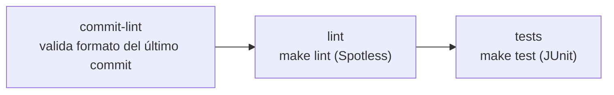

# CI — polizas-api

Pipeline en `.github/workflows/ci.yml`, se ejecuta en cada push y pull request.



Las tres etapas son secuenciales (`needs:`) — cada una solo corre si la anterior pasó, para no gastar minutos de CI compilando o testeando un commit que ya va a fallar por formato.

## Etapas

| Etapa | Qué valida |
|---|---|
| `commit-lint` | El mensaje del último commit cumple `:emoji: [scope] Mensaje` (ver `CLAUDE.md`) |
| `lint` | Formato de código con Spotless / google-java-format |
| `tests` | Suite JUnit 5 + Mockito + AssertJ |

`lint` y `tests` corren sobre Java 21 (Temurin), con cache de Maven vía `actions/setup-java`.

## Reproducir localmente

```bash
make lint   # equivalente a la etapa lint
make test   # equivalente a la etapa tests
make format # aplica el formato que lint exige, antes de commitear
```

`commit-lint` no tiene target de Makefile porque es una validación de texto plano sobre `git log -1 --pretty=%s`, no requiere el proyecto compilado.
